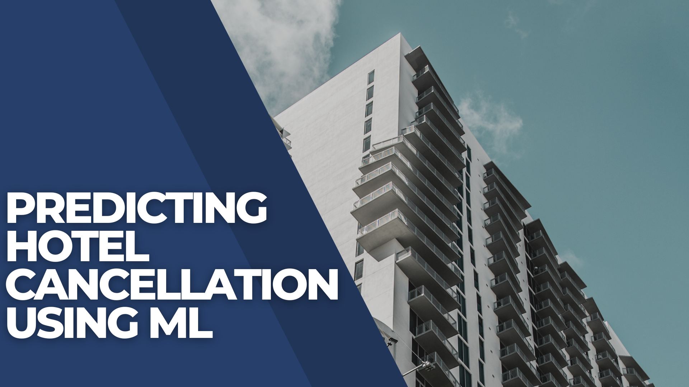
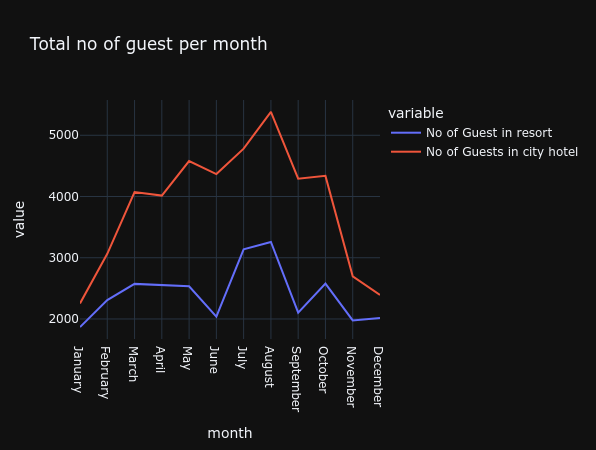
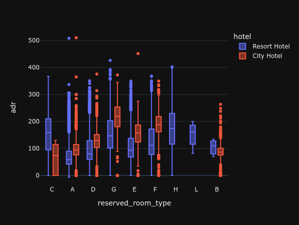
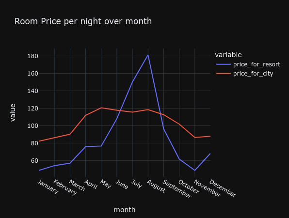
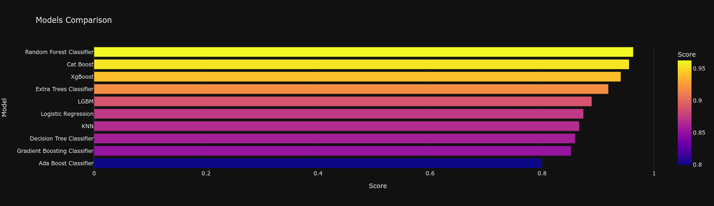

# Key Finding: 

## Business Problem 
Hotel cancellations result in huge losses for hotels for the following reasons:
1.    Lost of revenue when they cannot resell the room

2.    Additional costs of distribution channels by increasing commissions or paying for publicity to help sell these rooms

3.    Lowering prices last minute, so they can resell a room, resulting in reducing profit margin

Machine learning algorithms can be used to predict whether a hotel reservation will be cancelled, this can help hotels maximize revenue. 

## Data Source 
https://www.kaggle.com/datasets/jessemostipak/hotel-booking-demand?sort=votes

## Methods Used
- Data Cleaning and Preperation
- Exploratory Data Analysis 
- Machine Learning Model Building,Evaluation and Selection

## Project Walk Through 

### Data Cleaning and Preperation 
- Numpy and Pandas were used to transform the raw data into useable forms. The following methods were used: 
1. Handle Missing Data, and Dropping columns with more than 30% missing values. 
2. Outlier Treatment
3. Datetime series used to transform data into desirable form. 

## Exploratory Data Analysis
Data is analysed to get a better understanding of the business problem. 

Analysing the amount of guests arriving across the year, it is clear both hotels reach maximum occupancy in the summer, whilst having the least amount of guests in the winter months. 
Additionally, City hotel has more guests at all times throughout the year by a significant margin. 

The dynamic nature of Hotel room pricing can be seen in the Figure above; which shows the Average Daily Rate (ADR) for various room types across the year. 
Large interquartile ranges as well as long whiskers are indicitive of the large change in price for hotel rooms across the year. 

Analysing the room price by months across the year we see that, Resort Hotel's prices spike during summer when demand is higher whilst City hotels prices stay stable throughout the year. 
City hotel can maximize revenue by dynamically adjusting prices according to demand levels. 

All other analysis can be found in the notebook. 

## Feature Engineering and Selection 
- Function written to handle outliers
- Catagorical data is handled using Mean encoding
- Lasso Regression analysis is used to for feature selection.

## Model Building
The following machine learning models are implemented:
1. Logistic Regression
2. KNN
3. Decision Tree Classifier
4. Random Forest Classifier
5. Ada Boost Classifier
6. Gradient Boosting Classifier
7. XgBoost
8. Cat Boost
9. Extra Trees Classifier
10. LGBM 

Evaluating all the models, we see the random forrest classifier has the best performance metrics (precision, accuracy, recall), and is therfore selected for the model.
## Licence 
MIT License

Copyright (c) 2022 Zain Khan

Permission is hereby granted, free of charge, to any person obtaining a copy of this software and associated documentation files (the "Software"), to deal in the Software without restriction, including without limitation the rights to use, copy, modify, merge, publish, distribute, sublicense, and/or sell copies of the Software, and to permit persons to whom the Software is furnished to do so, subject to the following conditions:

The above copyright notice and this permission notice shall be included in all copies or substantial portions of the Software.

THE SOFTWARE IS PROVIDED "AS IS", WITHOUT WARRANTY OF ANY KIND, EXPRESS OR IMPLIED, INCLUDING BUT NOT LIMITED TO THE WARRANTIES OF MERCHANTABILITY, FITNESS FOR A PARTICULAR PURPOSE AND NONINFRINGEMENT. IN NO EVENT SHALL THE AUTHORS OR COPYRIGHT HOLDERS BE LIABLE FOR ANY CLAIM, DAMAGES OR OTHER LIABILITY, WHETHER IN AN ACTION OF CONTRACT, TORT OR OTHERWISE, ARISING FROM, OUT OF OR IN CONNECTION WITH THE SOFTWARE OR THE USE OR OTHER DEALINGS IN THE SOFTWARE.